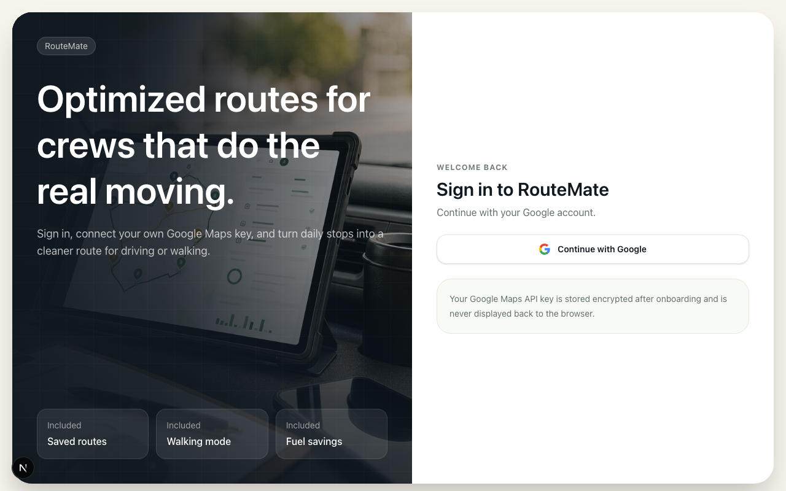

# RouteMate

Day 18 of Savion's 100 Day AI Build Challenge: one app per day for 100 days.

RouteMate is a premium route planning app for service workers, door-to-door teams, and local businesses. Users sign in with Google, connect their own Google Maps API key, build daily stop lists, optimize the route order, compare the entered route against the optimized path, and open the final route in Google Maps.

## Features

- Google sign-in through Supabase Auth
- Secure onboarding for a user-owned Google Maps API key
- Server-side encrypted API key storage in Supabase
- Saved daily routes with driving or walking mode
- Optional start time and average stop duration for traffic-aware workday estimates
- Blank end address automatically returns the route to the start address
- Address autocomplete and verification
- Notes and service windows per stop
- Add, edit, delete, and reorder stops
- Google Routes API optimization with stored original and optimized polylines
- Interactive Google map with optimized route, entered-order route, and a subtle animated route pulse
- Distance, drive time, workday time, mileage impact, fuel cost, and fuel savings
- Google Maps handoff and share link copy
- Responsive premium SaaS UI for phone, tablet, and desktop

## Screenshot



## Install

```bash
git clone https://github.com/Still-InFrame/day-18-routemate.git
cd day-18-routemate
npm install
npm run dev
```

## Setup

Run `supabase/routemate_schema.sql` in the shared 100-day Supabase sandbox SQL editor before using the app.

The app also needs this local-only environment variable in `.env.local`:

```bash
ROUTEMATE_ENCRYPTION_KEY=replace-with-32-byte-base64-or-long-random-string
```

Users must enable the relevant Google APIs for their own key: Routes API, Maps JavaScript API, Geocoding API, and Places API.

## Stack

- Next.js App Router
- TypeScript
- Tailwind CSS
- Supabase Auth and database
- Google Maps JavaScript API
- Google Routes API
- Google Geocoding API
- Google Places API

## Challenge

Follow the build journey at https://www.100dayaichallenge.com/share/savion
